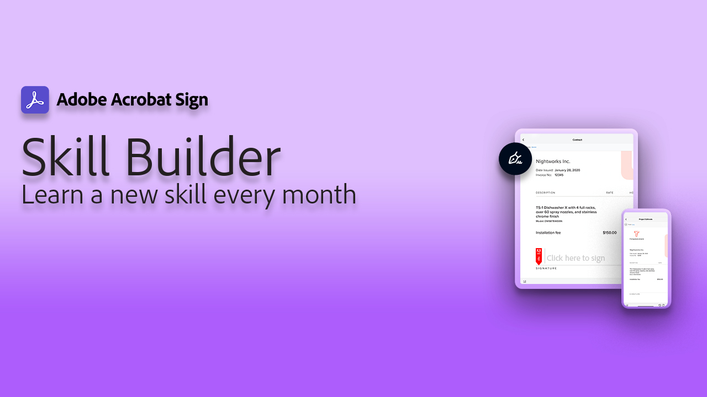

# 行业和部门概述

通过探索这些真实的行业和部门用例、食谱和网络研讨会，了解如何变换组织的电子签名体验。

<table style="table-layout:fixed">
<tr>
  <td>
    
    

    <a href="innovation-series.md"><strong>技能生成器</strong></a>
    

    <em>加入我们，使用30分钟的技能构建器，了解如何在不增加任何额外工作的情况下让您的电子签名发挥作用</em>
     
  </td>
  <td>
    
    

    <a href="recipes.md"><strong>用例</strong></a>
    

    <em>探索各种组织如何将这些实际用例与Acrobat Sign结合使用</em>
     
  </td>
 </td>
  <td>
    
    

     
  </td>
  <td>
    
    

     
  </td>
</tr>
</table>
