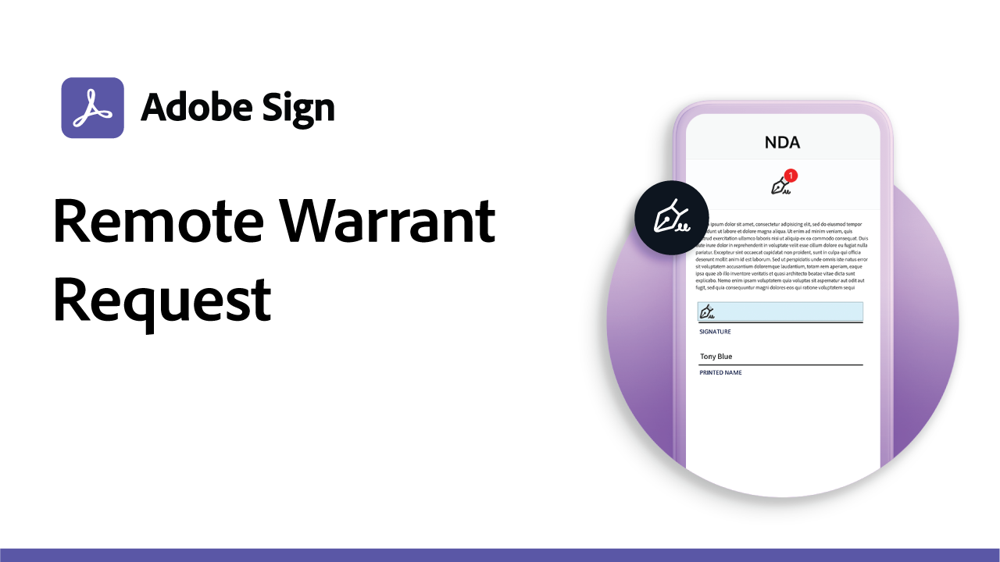

# 用例配方

通过这些政府和商业电子签名示例加快组织的数字工作流程。 单击即可查看PDF，其中包含有关如何设置这些特定电子签名使用情形的资源和详细信息。

## 新增功能

* [教育Web表单实习申请](usecase-edu-intern.md)
了解如何使用Web表单来改进学生对所需表单的访问
* [具有多个未知签名者的政府贷款申请](webform-multiple-signers.md)
了解如何将Web表单用于涉及多个未知参与者的复杂政府贷款申请工作流程

## 政府用例

<table style="table-layout:fixed">
<tr>
  <td>
    
    

    <a href="webform-multiple-signers.md"><strong>具有多个未知签名者的政府贷款申请</strong></a>
    

    <em>了解如何将Web表单用于涉及多个未知参与者的复杂政府贷款申请工作流程</em>
     
  </td> 
  <td>
    
    

    <a href="usecasegovgrants.md"><strong>商业补助和贷款</strong></a>
    

    <em>通过自助方式获取赠款、贷款和税收递延申请表，为企业提供快速帮助</em>
     
  </td> 
  <td>
    
    

    <a href="usecasegovtelework.md"><strong>远程工作协议</strong></a>
    

    <em>在远程工作协议、策略更新等内容上高效收集所有员工的签名</em>
     
  </td>
  <td>
    
    

    <a href="usecasegovcontracts.md"><strong>合同和申请表</strong></a>
    

    <em>用合规的数字工作流程快速取代纸张处理，并辅以审计报告</em>
     
  </td>
</tr>
<tr>
 <td>
    
    

    <a href="usecasegovreemployment.md"><strong>再就业援助</strong></a>
    

    <em>帮助公民获得他们需要的帮助，而无需与可在数天之内投入使用的全数字应用程序表单保持同步</em>
     
  </td>
  <td>
    
    

    <a href="usecasegovpaycheck.md"><strong>薪水支票保护</strong></a>
    

    <em>了解如何使用Acrobat Sign将付款保护计划表单转换为在线交互式表单</em>
     
  </td>
  <td>
    
    

    <a href="usecasegovremote.md"><strong>远程授权请求</strong></a>
    

    <em>同时使用电子签名和网络会议，缩短申请和获得法官授权所需的时间</em>
     
  </td>
  <td>
    
    

     
  </td>
</tr>
</table>

## 商业用例

<table style="table-layout:fixed">
<tr>
  <td>
    
    

    <a href="usecasecomcontracts.md"><strong>合同和申请表</strong></a>
    

    <em>用合规的数字工作流程快速取代纸张处理，并辅以审计报告</em>
     
  </td> 
  <td>
    
    

    <a href="usecasecompolicy.md"><strong>策略协议</strong></a>
    

    <em>高效收集所有员工对策略协议和更新的签名</em>
     
  </td>
  <td>
    
    

    <a href="usecasecomtelework.md"><strong>远程工作协议</strong></a>
    

    <em>高效收集远程工作协议中所有员工的签名</em>
     
  </td>
  <td>
    
    

     
  </td>
</tr>
</table>

## 教育使用案例

<table style="table-layout:fixed">
<tr>
  <td>
    
    

    <a href="usecase-edu-intern.md"><strong>教育Web表单实习申请</strong></a>
    

    <em>了解如何使用Web表单来改进学生对所需表单的访问</em>
     
  </td> 
  <td>
    
    

     
  </td>
  <td>
    
    

     
  </td>
  <td>
    
    

     
  </td>
</tr>
</table>

