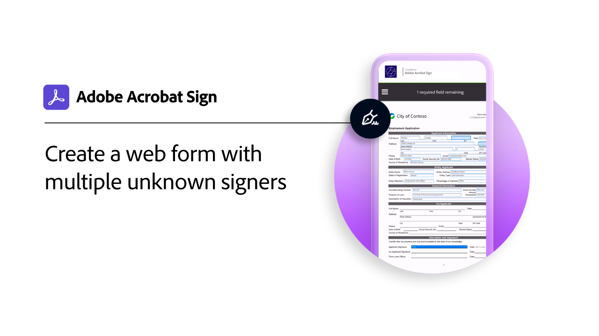

# 用例

探索各种组织如何使用Acrobat Sign来转变其组织的数字工作流程，并提供这些实际用例。

## 新增功能

>[!BEGINTABS]

>[!TAB 适用于教育的IEP进程的自定义工作流]

了解如何使用[自定义工作流程Designer](usecase-edu-iep.md)将个性化教育计划(IEP)流程数字化。

>[!TAB 教育Web表单实习申请]

了解如何使用[Web表单](usecase-edu-intern.md)来改善学生对所需表单的访问。

>[!TAB 创建教育Web表单实习申请]

了解如何创建实习[Web表单](usecase-edu-intern-create.md)。

>[!TAB 具有多个未知签名者的政府贷款申请]

了解[Web表单](webform-multiple-signers.md)如何用于涉及多个未知参与者的复杂政府贷款申请工作流程。

>[!ENDTABS]

## 政府用例

<table style="table-layout:fixed">
<tr>
  <td>
    
    

    <a href="webform-multiple-signers.md"><strong>具有多个未知签名者的政府贷款申请</strong></a>
    

    <em>了解Web表单如何用于涉及多个未知参与者的复杂政府贷款申请工作流程</em>
     
  </td> 
  <td>
    
    

    <a href="usecasegovgrants.md"><strong>商业补助和贷款</strong></a>
    

    <em>通过自助访问授予、贷款和税收递延申请表，为企业提供快速帮助</em>
     
  </td> 
  <td>
    
    

    <a href="usecasegovtelework.md"><strong>远程工作协议</strong></a>
    

    <em>有效收集所有员工对远程工作协议、策略更新等的签名</em>
     
  </td>
  <td>
    
    

    <a href="usecasegovcontracts.md"><strong>合同和申请表</strong></a>
    

    <em>使用合规的数字工作流程快速取代纸面处理，辅以审核报告</em>
     
  </td>
</tr>
<tr>
 <td>
    
    

    <a href="usecasegovreemployment.md"><strong>再就业帮助</strong></a>
    

    <em>帮助市民获得所需的帮助，而无需排队等待数天即可上线的全数字申请表</em>
     
  </td>
  <td>
    
    

    <a href="usecasegovpaycheck.md"><strong>Paycheck保护</strong></a>
    

    <em>了解如何使用Acrobat Sign将付款保护计划表单转换为联机交互式表单</em>
     
  </td>
  <td>
    
    

    <a href="usecasegovremote.md"><strong>远程授权请求</strong></a>
    

    <em>同时使用电子签名和Web会议，以减少请求并获取法官的授权证所需的时间</em>
     
  </td>
  <td>
    
    

     
  </td>
</tr>
</table>

## 商业用例

<table style="table-layout:fixed">
<tr>
  <td>
    
    

    <a href="usecasecomcontracts.md"><strong>合同和申请表</strong></a>
    

    <em>使用合规的数字工作流程快速取代纸面处理，辅以审核报告</em>
     
  </td> 
  <td>
    
    

    <a href="usecasecompolicy.md"><strong>策略协议</strong></a>
    

    <em>高效地收集所有员工对策略协议和更新的签名</em>
     
  </td>
  <td>
    
    

    <a href="usecasecomtelework.md"><strong>远程工作协议</strong></a>
    

    <em>高效地收集所有员工对远程工作协议的签名</em>
     
  </td>
  <td>
    
    

     
  </td>
</tr>
</table>

## 教育用例

<table style="table-layout:fixed">
<tr>
  <td>
    
    

    <a href="usecase-edu-intern.md"><strong>教育Web表单实习申请</strong></a>
    

    <em>了解如何使用Web表单改善学生对所需表单的访问</em>
     
  </td> 
  <td>
    
    

    <a href="usecase-edu-intern-create.md"><strong>创建教育Web表单实习申请</strong></a>
    

    <em>了解如何创建实习Web表单</em>
     
  </td> 
  <td>
    
    

    <a href="usecase-edu-iep.md"><strong>适用于教育的IEP进程的自定义工作流</strong></a>
    

    <em>了解如何使用Designer自定义工作流程将个性化教育计划(IEP)流程数字化</em>
     
  </td>
  <td>
    
    

     
  </td>
</tr>
</table>

